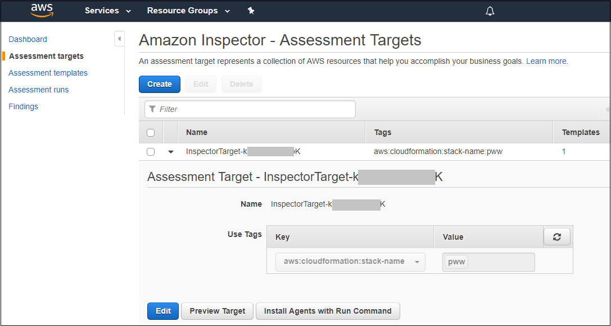
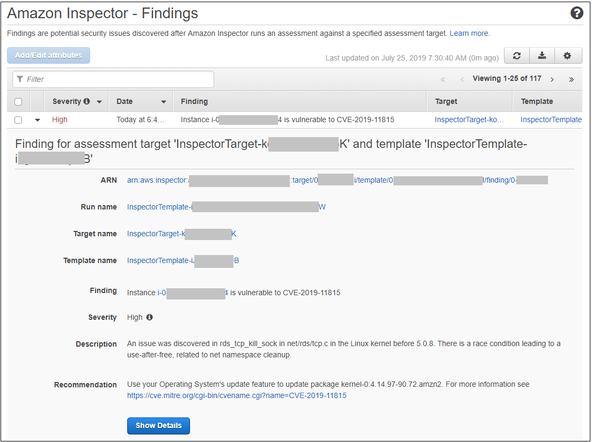

# Identifying and Remediating Host Vulnerabilities - Host Layer Round - Assess Phase

In the previous Build Phase, CloudFormation deployed a stack containing
some Amazon EC2 instances behind an application load balancer.
You are now going to learn about AWS Inspector.
AWS Inspector assesses the instances and identifies security findings that you will later remediate.

## Explore Amazon Inspector

You are now going to learn about AWS Inspector terms and explore the Inspector console.

### Understanding Amazon Inspector targets

1. Go to the Amazon Inspector console.

2. Click **Assessment Targets** on the left menu.  Assessment targets represent a group of EC2 instances that Inspector will assess.  You will see a target whose name begins with *InspectorTarget*.  Click on the arrow widget to open the target and display the details.  You should see something similar to the image below.

    

    In the figure above, notice that the *Use Tags* section contains a key/value pair with the entries *aws:cloudformation:stack-name* and *pww* respectively.  If you are at an AWS event, your stack name will be something like "mod-" and be followed by some additional characters.  This means that this Inspector target is configured to select all instances that are related to the CloudFormation stack with the given stack name.

    Tags are labels.  They are very helpful when you are working with variable numbers of instances.  Rather than specifying individual instance ids, you can select the instances with a specific tag and then do operations on that grgroup.  In the case of instances behind a load balancer, you may not know the instance IDs, but if they all share a tag then you can work on them collectively by tag.

3. Click the **Preview Target** button.  A new window opens as shown below.

    

    You now see there are three Instances that Inspector will assess based on the configuration of the target.

4. Click the **Assessment Templates** on the left menu.  A list of assessment templates appears as shown below.

    

    You will see an assement template whose name begins with *AssessmentTemplate*.  Assessment templates represent the selection of a target and one or more rules packages.  A rules package is a collection of rules that represent security checks.   This template assesses the previously mentioned target against the following two rules packages:

    Common Vulnerabilities and Exposures: The rules in this package help verify whether the EC2 instances in your assessment targets are exposed to common vulnerabilities and exposures (CVEs). Attacks can exploit unpatched vulnerabilities to compromise the confidentiality, integrity, or availability of your service or data. The CVE system provides a reference method for publicly known information security vulnerabilities and exposures. For more information, see [https://cve.mitre.org/](https://cve.mitre.org/){target=_blank}.  You typically remediate findings from this rules package by installing patches.

    Security Best Practices: The rules in this package help determine whether your systems are configured securely.  For example, one rule in this package checks to see if root login has been disabled over ssh.  You typically remediate the findings by adjusting configuration settings.

5.  On the Amazon Inspector menu, click **Assessment runs**.  You should see an entry for an assesment that was started on your behalf.  CloudFormation ran this for you to save time.  If the status is not, *Analysis complete,* then periodically refresh the screen until the status changes to *Analysis complete* as shown in the figure below.

    

6. On the line that represents your most recent run, make note of the number in the *Findings* column (117 in this diagram).  After you perform the remediation later in this workshop, that number should decrease.   Click on the number in the *Findings* column.  The findings associated with the run will appear as shown below.

    

    You will see one of the findings has been expanded to reveal more details.  The middle section of the finding has been removed to save space.

7.  Now that you have learned about Inspector assessments, you are ready to perform some remediation using AWS Systems Manager Patch Manager.  You will then run an Inspector assessment yourself to see if the number of findings has changed.

    Click [here](./remediate.md) to proceed to the Remediate Phase.

