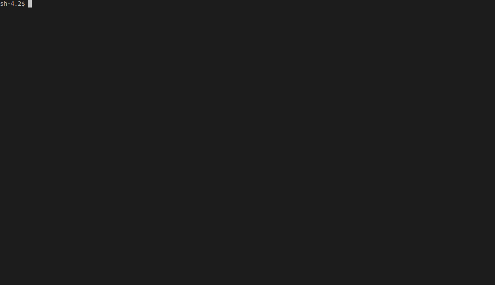
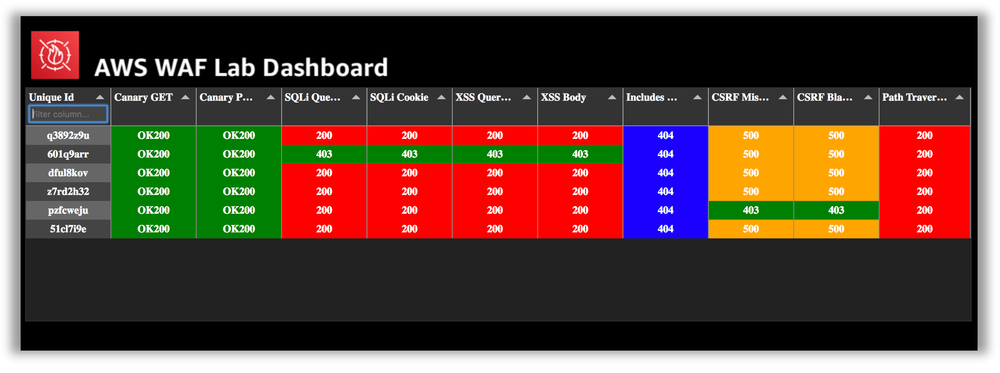

# Mitigating Common Web Application Attack Vectors Using AWS WAF - Assess Phase

In the previous Build Phase, you built a CloudFormation stack that contains
a PHP website on Amazon EC2 instances behind an application load balancer.
You are now going to assess the posture of the site and then add an AWS WAF Web ACL to your site. In this section you will do the following tasks:

1. Identify the stack you built
2. Look up the output values for your environment and test access
3. Use your Red Team Host to test for website vulnerabilities

## Identify the stack that you built

1. Go to the CloudFormation console in the same AWS region in which you created the stack in the Build Phase. You should see a list of stacks similar to the figure below. Locate the stack you created. In this documentation, the name of the stack is *pww*.  Copy this stack name into a scratch file on your workstation in case you need it later.

    

## Look up the Stack Outputs

1.  Go to the stack outputs and look for the website URL stored in the **albEndpoint** output value. Test access to the site by right clicking and opening in a new tab. Note the URL for your site as this will be used throughout this workshop round.

2.  For an AWS sponsored event, while in the stack outputs, note the **UniqueId** value. This Id value will be used to identify the posture of your site within the automated scanner and the <a href="http://waflabdash.awssecworkshops.com/" target="_blank">associated dashboard</a>.

3. While still in stack outputs, right click the link in **RedTeamHostSession** and open in new tab. This will launch an AWS Systems Manager Session Manager to the host you will use to perform manual scans against your site URL. 

!!! info "AWS Systems Manager Session Manager"
    Session Manager is a fully managed AWS Systems Manager capability that lets you manage your Amazon EC2 instances through an interactive one-click browser-based shell or through the AWS CLI. Session Manager provides secure and auditable instance management without the need to open inbound ports, maintain bastion hosts, or manage SSH keys. 

!!! Attention
    <p style="font-size:14px;">
      Please insure you are **using the improved AWS WAF console and API experience** for this workshop.
    </p>

## Website Scanning Environment and Tools

In order to test your AWS WAF ruleset, this lab has been configured with two scanning capabilities; a Red Team Host where you can invoke manual scanning and an automated scanner which runs from outside your lab environment. 

The scanner performs 10 basic tests designed to help simulate and mitigate common web attack vectors. 

1. Canary GET - Should not be blocked
2. Canary POST - Should not be blocked
3. SQL Injection (SQLi) in Query String
4. SQL Injection (SQLi) in Cookie
5. Cross Site Scripting (XSS) in Query String
6. Cross Site Scripting (XSS) in Body
7. Inclusion in Modules
8. Cross Site Request Forgery (CSRF) Token Missing
9. Cross Site Request Forgery (CSRF) Token Invalid
10. Path Traversal 

??? info  "Workshop Architecture" 
    

!!! info "Note about Tests"
    _These basic tests are designed to provide common examples you can use to test AWS WAF functionality. You should perform thorough analysis and testing when implementing rules into your production environments._

### Website Scanning Environment and Tools - Manual Scanning
Once you have started a Session Manager connection to your Red Team Host, the scanner script can be invoked by typing the following command:

````
runscanner
````


The scanner script will run each of the tests above and report back the following information:

- __Request__: The HTTP request command used.
- __Test Name__: The name of the test from list above.
- __Result__: The HTTP status code returned.

The logic in the scanner script color codes the response as follows:

- __Green__: 403 - Forbidden (_Except for canary GET and POST tests._)
- __Red__: 200 - OK
- __Blue__: 404 - Not Found
- __Yellow__: 500 - Internal Server Error

What are the results of running the scanner script? Were the simulated malicious requests blocked? As you can see by running the script there are several vulnerabilities that need to be addressed. In the remediate phase you will configure an AWS WAF Web ACL to block these requests. When AWS WAF blocks a web request based on the conditions that you specify, it returns HTTP status code 403 (Forbidden). For a full view of the request and response information, you can paste the **Request** command directly into the console and add the --debug argument.

!!! info "Note about Testing Tool"
    The scanner script uses an open source <a href="https://httpie.org/" target="_blank">HTTP client called httpie</a>. HTTPie—aitch-tee-tee-pie—is a command line HTTP client with an intuitive UI, JSON support, syntax highlighting, wget-like downloads, plugins, and more.


### Website Scanning Environment and Tools - Automated Scanning

For an AWS sponsored event, in addition to the manual scanning, automated scanning is also performed against your lab website. The automated tests are similar to the manual tests but the results are posted to <a href="http://waflabdash.awssecworkshops.com/" target="_blank">a centralized scanning results dashboard</a> along with the other workshop participants. You can identify the scanning results for your site using the UniqueId found in the CloudFormation outputs.



---

You can now proceed to the [Remediate Phase](remediate.md).
