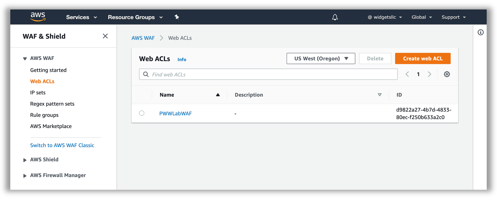
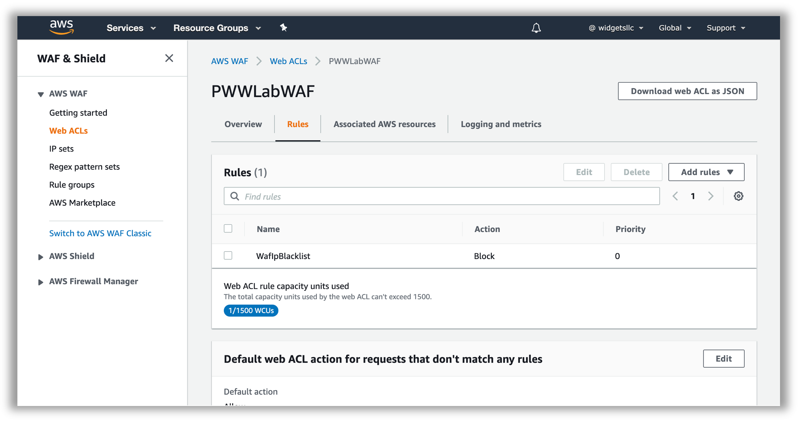
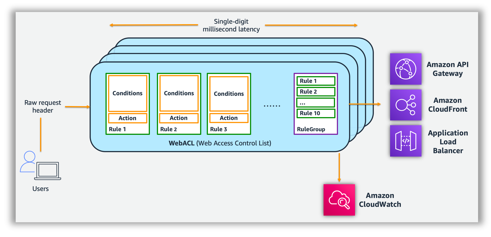
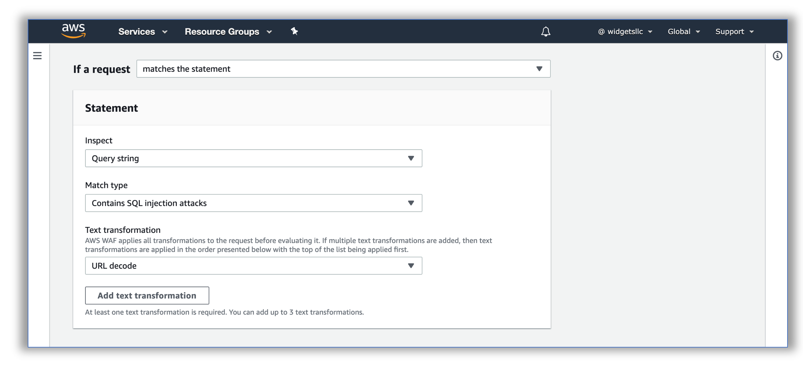

# Mitigating Common Web Application Attack Vectors Using AWS WAF - Remediate Phase

In the previous Build Phase, you identified several vulnerabilities in your web application.
You are now going to design and implement an AWS WAF ruleset to help mitigate these vulnerabilities. In this section you will do the following tasks:

1. Identify the WAF ACL for your site
2. AWS WAF Rule design and considerations
3. Console Walkthrough - Creating a Rule
4. WAF Rule Creation and Solutions

!!! Attention
    <p style="font-size:14px;">
      If the list of Web ACLs appears empty select the correct AWS Region based on the AWS region where the CloudFormation stack was launched **IN THE Web ACLs area of the window**. Please ensure you are **NOT using the AWS WAF Classic console** for this workshop.
    </p>

## Identify the WAF ACL for your Site

1. If needed, go to <a href="https://console.aws.amazon.com/console/home" target="_blank">https://console.aws.amazon.com/console/home</a>. You will be redirected to the AWS Management Console dashboard on successful login:

Make sure you select the appropriate AWS Region when working in the AWS Management Console (top right corner, on the menu bar).

2. From the Management Console dashboard, navigate to the AWS WAF & Shield service console. You can do that several ways:
    - Type “waf” in the AWS services panel search box and select the resulting option
    - Expand the Services drop down menu (top left on the menu bar) and choose WAF & Shield
    - Expand the All services area of the AWS services panel and choose WAF & Shield
Once selected, you will be redirected to the AWS WAF & AWS Shield service console. You may see an initial landing page at first. Choose Go to AWS WAF:


3.  In the side bar menu on the left, pick the Web ACLs option under the AWS WAF heading. If the list of Web ACLs appears empty select the correct AWS Region based on the AWS region where the CloudFormation stack was launched **IN THE Web ACLs area of the window**. If you are sharing the same account with other participants you can identify your WAF ACL by the Id in the stack outputs in the region where the stack was launched.


4. Click on the WAF Web ACL Name to select the existing Web ACL. Once the detail pane is loaded on the left of your screen, you will see three tabs: Requests, Rules, and Logging. Toggle to Rules:


Validate that you are able to see a pre-existing rule, configured to block requests, and that your Web ACL is associated with an Application load balancer resource. You can drill down further into the properties of the existing rule, by selecting the rule name and clicking **Edit**. This rule references IP sets for the loopback/localhost IP addresses (127.0.0.0/8, ::1/128).

!!! info "Viewing and Logging Requests"
    _In the **Overview** tab for your Web ACL, you can view a <a href="https://docs.aws.amazon.com/waf/latest/developerguide/web-acl-testing.html#web-acl-testing-view-sample" target="_blank">sample of the requests</a> that have been inspected by the WAF. For each sampled request, you can view detailed data about the request, such as the originating IP address and the headers included in the request. You also can view which rule the request matched, and whether the rule is configured to allow or block requests. You can refer to the sampled requests throughout this exercise to monitor activity and look for suspicious activity. Although not used in this workshop, in the **Logging and metrics** tab, <a href="https://docs.aws.amazon.com/waf/latest/developerguide/logging.html" target="_blank">you can enable full logging</a> to get detailed information about traffic that is analyzed by your web ACL._

##AWS WAF Rule Design and Considerations

###Basics

You use AWS WAF to control how an Amazon CloudFront distribution, an Amazon API Gateway API, or an Application Load Balancer responds to web requests.

**Web ACLs** – You use a web access control list (ACL) to protect a set of AWS resources. You create a web ACL and define its protection strategy by adding rules. Rules define criteria for inspecting web requests and specify how to handle requests that match the criteria. You set a default action for the web ACL that indicates whether to block or allow through those requests that pass the rules inspections.

**Rules** – Each rule contains a statement that defines the inspection criteria, and an action to take if a web request meets the criteria. When a web request meets the criteria, that's a match. You can use rules to block matching requests or to allow matching requests through. You can also use rules just to count matching requests.

**Rules groups** – You can use rules individually or in reusable rule groups. AWS Managed Rules and AWS Marketplace sellers provide managed rule groups for your use. You can also define your own rule groups.

Rule statements are the part of a rule that tells AWS WAF how to inspect a web request. When AWS WAF finds the inspection criteria in a web request, we say that the web request matches the statement. Every rule statement specifies what to look for and how, according to the statement type.

Every rule in AWS WAF has a single top-level rule statement, which can contain other statements. Rule statements can be very simple. For example, you could have a statement that provides just a set of originating countries to check your web requests for. Rule statements can also be very complex. For example, you could have a statement that combines many other statements with logical AND, OR, and NOT statements.

#### How WAF Works


After you create your web ACL, you can associate it with one or more AWS resources. The resource types that you can protect using AWS WAF web ACLs are Amazon CloudFront distributions, Amazon API Gateway APIs, and Application Load Balancers.

!!! info "Note About This Section"
    **In order to illustrate the process of creating WAF rules, we will walk through the creation of the first rule in your WAF ACL.** The complete list of threats and solutions is available in the <a href="./#waf-rule-creation-and-solutions">WAF Rule Creation and Solutions</a> section.

###Rule Design Considerations:

Use the following guiding questions when planning WAF rules:

1.	What is the intended purpose of the rule?
2.	What HTTP request components apply to the purpose of the rule?
3.	Do you already have rules or rule groups targeting those request components that you can expand? Is that desirable?
4.	How can you define the purpose of the rule in a Boolean logic expression?
5.	Will the rule require nested statements under logical AND or OR rule statements?
6.	Are any transformations relevant to my input content type?

####Sample Rule purpose:

- **Detect SQL Injection in query string, use ‘block’ action in Web ACL**

####HTTP request components:

- **Request Method** – form input typically gets submitted using a GET HTTP request method
- **Query String** – the SQL injection attempt is located in the query string 

####Define the purpose of the rule using Boolean logic:

- If **Query String contains suspected SQL Injection** then **block**

####Sample Rule - Statement to implement:

- **Contains SQL injection attacks Match type** targeting the request **Query string**

####Relevant transformations:

- **Contains SQL injection attacks Match type** query string is URL encoded, so we will apply the **URL_DECODE** transformation.

####Rules to implement:

- Rule with 1 predicate Contains SQL injection attacks Match type

##Console Walkthrough - Creating a Rule

1. In the AWS WAF console, create a SQL injection rule by clicking the Web ACL, **Add rules**, **Add my own rules and rule groups**

2.	Click on **Rule builder**, provide **matchSQLi** for the **Name** and keep **Regular rule** for **Type**:


3.	For **If a request** select **matches the statement**. Under **Statement**, for **Inspect** select **Query string**, for **Match type** select **Contains SQL injection attacks**, for **Text transformation** select **URL decode** and for **Action** select **Block**.


4.	Click on **Add Rule** and then click **Save**

5. View the **matchSQLi** rule in the **Rule visual editor** to confirm it is correct.

!!! info "Additional Resources"
    For a more comprehensive discussion of common vulnerabilities for web applications, as well as how to mitigate them using AWS WAF, and other AWS services, please refer to the <a href="https://d0.awsstatic.com/whitepapers/Security/aws-waf-owasp.pdf" target="_blank">Use AWS WAF to Mitigate OWASP’s Top 10 Web Application Vulnerabilities whitepaper</a>.

## WAF Rule Creation and Solutions

In this phase, we will have a set of 6 exercises walking you through the process of building a basic mitigation rule set for common vulnerabilities. We will build these rules from scratch, so you can gain familiarity with the AWS WAF programming model and you can then write rules specific to your applications. 

!!! info "Note About Exercise Solutions"
    For the exercises below, you will find the high level description and solution configuration for your web ACL. You can test your ACL ruleset at any time using the Red Team Host. For AWS sponsored event, you can also view test results on the WAF Lab Dashboard.

### 1. SQL Injection & Cross Site Scripting Mitigation

Use the SQL injection, cross-site scripting, as well as string and regex matching to build rules that mitigate injection attacks and cross site scripting attacks.

Consider the following:

- How does your web application accept end-user input (whether directly or indirectly). Which HTTP request components does that input get inserted into?
- What kind of content encoding considerations do you need to factor in for the input format?
- What considerations do you need to account for in regards to false positives? For example, does your application legitimately need to accept SQL statements as input?

How do the requirements derived from the above questions affect your solution?

??? info "SQL Injection Solution"
    1.	Update the **matchSQLi** rule with 2 additional statements
        1. Select the **matchSQLi** rule and click **Edit** (_You should have created this rule in <a href="./#console-walkthrough-creating-a-rule">the walk through above</a>_)
        2. Change **If a request** to **matches at least one of the statements (OR)**
        3. Click **Add another statement**: body, contains sql injection attacks, html entity decode and URL decode
        4. Click **Add another statement**: header, cookie (_type manually_), contains sql injection attacks, url decode
    2.  View the existing matchSQLi rule to confirm additional conditions
    3.  Re-run the WAF test script (runscanner) from your red team host to confirm requests are blocked

!!! info "Rule JSON editor"
    Thus far you have used the Visual Rule Editor to create WAF Rules but every web ACL also has a JSON format representation. In there, you see these special types of rule statements. For rules of any complexity, managing your web ACL using the JSON editor is the easiest way to go. You can retrieve the complete configuration for a web ACL in JSON format, modify it as you need, and then provide it through the console, API, or CLI. AWS WAF supports nesting of rule statements. To combine rule statement results, you nest the statements under logical AND or OR rule statements. The visual editor on the console supports one level of rule statement nesting, which works for many needs. To nest more levels, you can edit the JSON representation of the rule on the console.

??? info "Cross Site Scripting Solution"
    1.	Create a new rule named **matchXSS** and for **If a request** choose **matches at least one of the statements (OR)**. Add statements:
        1. all query parameters, contains xss injection attacks, url decode
        2. body, contains xss injection attacks, html entity decode and url decode
        4. header, cookie (_type manually_), contains xss injection attacks, url decode
        5. Click on **Add Rule** and then click **Save**
    2.	**Edit** the rule, click the **Rule JSON editor** and note the structure and syntax of the rule logic. 
    3. Add an exception statement for the XSS rule to allow access to _/reportBuilder/Editor.aspx_. _Note that we are using the JSON editor here due to the nested logic required for the exception._

	    1. After reviewing it, clear the existing editor content for the matchXSS rule and paste the following JSON

        <details><summary>Nested Statement with XSS Exception Solution</summary>
        <p>
        
            {
                "Name": "matchXSS",
                "Priority": 2,
                "Action": {
                    "Block": {}
                },
                "VisibilityConfig": {
                    "SampledRequestsEnabled": true,
                    "CloudWatchMetricsEnabled": true,
                    "MetricName": "matchXSS"
                },
                "Statement": {
                    "AndStatement": {
                        "Statements": [{
                                "NotStatement": {
                                    "Statement": {
                                        "ByteMatchStatement": {
                                            "SearchString": "/reportBuilder/Editor.aspx",
                                            "FieldToMatch": {
                                                "UriPath": {}
                                            },
                                            "TextTransformations": [{
                                                "Priority": 0,
                                                "Type": "NONE"
                                            }],
                                            "PositionalConstraint": "STARTS_WITH"
                                        }
                                    }
                                }
                            },
                            {
                                "OrStatement": {
                                    "Statements": [{
                                            "XssMatchStatement": {
                                                "FieldToMatch": {
                                                    "QueryString": {}
                                                },
                                                "TextTransformations": [{
                                                    "Priority": 0,
                                                    "Type": "URL_DECODE"
                                                }]
                                            }
                                        },
                                        {
                                            "XssMatchStatement": {
                                                "FieldToMatch": {
                                                    "Body": {}
                                                },
                                                "TextTransformations": [{
                                                        "Priority": 0,
                                                        "Type": "HTML_ENTITY_DECODE"
                                                    },
                                                    {
                                                        "Priority": 1,
                                                        "Type": "URL_DECODE"
                                                    }
                                                ]
                                            }
                                        },
                                        {
                                            "XssMatchStatement": {
                                                "FieldToMatch": {
                                                    "SingleHeader": {
                                                        "Name": "cookie"
                                                    }
                                                },
                                                "TextTransformations": [{
                                                    "Priority": 0,
                                                    "Type": "URL_DECODE"
                                                }]
                                            }
                                        }
                                    ]
                                }
                            }
                        ]
                    }
                }
            }

        </p>
        </details>

    4. Click **Save rule**
    5.  Re-run the WAF test script (runscanner) from your red team host to confirm requests are blocked

### 2. Mitigate File Inclusion & Path Traversal

Use the string and regex matching to build rules that block specific patterns indicative of unwanted path traversal or file inclusion.

Consider the following:

- Can end users browse the directory structure of your web folders? Do you have directory indexes enabled?
- Is your application (or any dependency components) use input parameters in filesystem or remote URL references? 
- Do you adequately lock down access so input paths cannot be manipulated?
- What considerations do you need to account for in regards to false positives (directory traversal signature patterns)?  

Build rules that ensure the relevant HTTP request components used for input into paths do not contain known path traversal patterns.

??? info "Solution"
    1.	Create a new rule named **matchTraversal** and for **If a request** choose **matches at least one of the statements (OR)**. Add statements:
        1. uri_path, starts with string, _/include_, url_decode 
        2. all_query_parameters, contains string, _../_, url_decode
        3. Click on **Add Rule** and then click **Save**
    2.  Re-run the WAF test script (runscanner) from your red team host to confirm requests are blocked

### 3. Enforce Request Hygiene

Use the string and regex matching, size constraints and IP address matching to build rules that block non-conforming or low value HTTP requests.

Consider the following:

•	Are there limits to the size of the various HTTP request components relevant to your web application? For example, does your application ever use URIs that are longer than 100 characters in size?

•	Are there specific HTTP request components without which your application cannot operate effectively (e.g. CSRF token header, authorization header, referrer header)?

Build rules that ensure the requests your application ends up processing are valid, conforming and valuable.

??? info "Solution"
    1.	In the left pane, choose **Regex pattern sets**, **Create regex pattern set** 
        1.	**Regex pattern set name** _csrf_, **Regular expressions** _^[0-9a-f]{40}$_
            1. The Regex pattern above is a simple example that matches the string length (40) and characters (0-9 or a-f). Copy the Regex pattern set ID into a scratch file to refer to it later.
            2. Note your AWS account Id (_in CloudFormation Stack Outputs_) and region and add them to the scratch file.

    2.	Create a new rule and choose **Rule JSON editor**

	    1. Delete any existing text and paste the following JSON below. Review the statements in the JSON
        
        2. **Update the region, AWS account Id and Regex pattern ID** with the one created in the previous step

        <details><summary>Nested Statement with Request Hygiene Solution</summary>
        <p>

            {
            	"Name": "matchCSRF",
            	"Priority": 3,
            	"Action": {
            		"Block": {}
            	},
            	"VisibilityConfig": {
            		"SampledRequestsEnabled": true,
            		"CloudWatchMetricsEnabled": true,
            		"MetricName": "matchCSRF"
            	},
            	"Statement": {
            		"AndStatement": {
            			"Statements": [{
            					"NotStatement": {
            						"Statement": {
            							"RegexPatternSetReferenceStatement": {
            								"ARN": "arn:aws:wafv2:YOUR_REGION:ACCOUNT_ID:regional/regexpatternset/csrf/YOUR_REGEX_PATTERN_ID",
            								"FieldToMatch": {
            									"SingleHeader": {
            										"Name": "x-csrf-token"
            									}
            								},
            								"TextTransformations": [{
            									"Priority": 0,
            									"Type": "URL_DECODE"
            								}]
            							}
            						}
            					}
            				},
            				{
            					"OrStatement": {
            						"Statements": [{
            								"ByteMatchStatement": {
            									"SearchString": "/form.php",
            									"FieldToMatch": {
            										"UriPath": {}
            									},
            									"TextTransformations": [{
            										"Priority": 0,
            										"Type": "NONE"
            									}],
            									"PositionalConstraint": "STARTS_WITH"
            								}
            							},
            							{
            								"ByteMatchStatement": {
            									"SearchString": "/form.php",
            									"FieldToMatch": {
            										"UriPath": {}
            									},
            									"TextTransformations": [{
            										"Priority": 0,
            										"Type": "NONE"
            									}],
            									"PositionalConstraint": "EXACTLY"
            								}
            							}
            						]
            					}
            				}
            			]
            		}
            	}
            }

        </p>
        </details>

    4. Click **Save rule**
    5.  Re-run the WAF test script (runscanner) from your red team host to confirm requests are blocked

!!! Attention
    <p style="font-size:14px;">
      **Unless you are only completing the Perimeter Layer round, if you have 30 minutes or less remaining in the workshop, you should consider proceeding to the [Host Layer round](/workshop/host-layer/assess/).** There will be time during the Inspector Assessment run to continue the WAF exercises.
    </p>

### 4. Detect & Mitigate Anomalies

Use a rate-based rule to track the rate of requests for each originating IP address and trigger the rule action to block IPs with rates that go over a limit. You set the limit as the number of requests per 5-minute time span. You can narrow the scope of the requests that AWS WAF counts. To do this, you nest another statement inside the rate-based statement. 

What constitutes an anomaly in regards to your web application? A few common anomaly patterns are:

- Unusually elevated volume of requests in general
- Unusually elevated volumes of requests to specific URI paths
- Unusually elevated levels of requests generating specific non-HTTP status 200 responses
- Unusually elevated volumes from certain sources (IPs, geographies)

Build a rate-based rule to limit excessive requests (100 within a 5-minute time span) to a site form; _/form.php_.

??? info "Solution"
    1.	Create a new rule named **FormRateLimit** of type **Rate-based rule** 
        1. **Request rate details**, Rate limit, 100
        2. IP address to use for rate limiting, Source IP address
        3. Criteria to count request towards rate limit, Only consider requests that match the criteria in a rule statement
    2. **If a request** choose **matches at least one of the statements (OR)**. Add statements:
        1. uri_path, starts with string, _/form.php_, None
        2. http_method, exactly matches string, _POST_ _(type in)_, None
    3. Click on **Add Rule** and then click **Save**
    4. Run a different WAF test script, ```` runratest ```` from your red team host to simulate excessive requests to your test site.
    
    The ___runratest___ script will send 400 sequential requests to _/form.php_ on your test site. When the rate-based rule action is triggered, requests will be blocked and return ***responseHTTP/1.1 403 Forbidden*** response instead of ***responseHTTP/1.1 200 OK***. 
    
    !!! info "Note About Rate-based rules"
        The rate limit of 100 over a 5 minute time span is used here to deomonstrate how the rate-based rule works. This value can be increased as needed for production deployments.  By default, AWS WAF aggregates requests based on the IP address from the web request origin, but you can configure the rule to use an IP address from an HTTP header, like X-Forwarded-For, instead. Learn more about <a href="https://docs.aws.amazon.com/waf/latest/developerguide/waf-rule-statement-type-rate-based.html" target="_blank">Rate-based AWS WAF rules</a>.

!!! info "Note About Remaining Exercises"
    **The remaining exercises below are optional. You should proceed to the [Verify Phase](verify.md) and come back to the content below if time permits.**

---

### 5. Limit Attack Footprint (Optional)

Use geo matching to build rules that limit the attack footprint against the exposed components of your application.

Consider the following:
•	Does your web application have server-side include components in the public web path?

•	Does your web application have components at exposed paths that are not used (or dependencies have such functions)?

•	Do you have administrative, management, status or health check paths and components that aren’t meant for end user access?

You should consider blocking access to such elements, or limiting access to known sources, either whitelisted IP addresses or geographic locations.

??? info "Solution"
    1.	Create a new rule and choose **Rule JSON editor**

	    1. Paste the following JSON and update the region and Regex pattern ID with the one created in the previous step

        <details><summary>Nested Statement with Limit Attack Footprint Solution</summary>
        <p>

            {
            	"Name": "matchAdminNotAffiliate",
            	"Priority": 4,
            	"Action": {
            		"Block": {}
            	},
            	"VisibilityConfig": {
            		"SampledRequestsEnabled": true,
            		"CloudWatchMetricsEnabled": true,
            		"MetricName": "matchAdminNotAffiliate"
            	},
            	"Statement": {
            		"AndStatement": {
            			"Statements": [{
            					"NotStatement": {
            						"Statement": {
            							"GeoMatchStatement": {
            								"CountryCodes": [
            									"US",
            									"RO"
            								]
            							}
            						}
            					}
            				},
            				{
            					"ByteMatchStatement": {
            						"FieldToMatch": {
            							"UriPath": {}
            						},
            						"PositionalConstraint": "STARTS_WITH",
            						"SearchString": "/admin",
            						"TextTransformations": [{
            							"Type": "NONE",
            							"Priority": 0
            						}]
            					}
            				}
            			]
            		}
            	}
            }

        </p>
        </details>

    2. Click on **Add Rule** and then click **Save**

### 6. Reputation Lists, Nuisance Requests (Optional)

Reputation lists (whitelists or blacklists) are a good way to filter and stop servicing low value requests. This can reduce operating costs, and reduce exposure to attack vectors. Reputation lists can be self-maintained: lists of identifiable actors that you have determined are undesired. They can be identified any number of ways:

- the source IP address
- the user agent string
- reuse of hijacked authorization or session tokens,
- attempting to make requests to paths that clearly do not exist in your application but are well known vulnerable software packages (probing)
- Usual request signatures (referrers, user agent strings, content types, etc)

Build blacklists of such actors using the relevant statements and set up rules to match and block them. An example IP-based blacklist already exists in your sandbox environment.

Reputation lists can also be maintained by third parties. The AWS WAF Security Automations allow you to implement IP-based reputation lists.

??? info "Solution"
    1.	edit the **IP set** **SampleIPSetV4**
        1. add a test IP address _You can obtain your current IP at <a href="https://ifconfig.co/" target="_blank">Ifconfig.co</a> The entry should follow CIDR notation. i.e. 10.10.10.10/32 for a single host._
    2.	Create a new rule named **matchRepNuisance**
        1.	uri_path, starts with, no transform, _/phpmyadmin_
    3.	Use the concepts you learned in the previous exercises to add the _filterNoPath_ statement to your Web ACL.

### 7. Deploy Managed Rules for AWS WAF (Optional)

<a href="https://docs.aws.amazon.com/waf/latest/developerguide/aws-managed-rule-groups-list.html#aws-managed-rule-groups-baseline" target="_blank">AWS Managed Rules</a> for AWS WAF is a managed service that provides protection against common application vulnerabilities or other unwanted traffic, without having to write your own rules. Managed rules are also available through the <a href="https://console.aws.amazon.com/wafv2/homev2/marketplace" target="_blank">AWS Marketplace</a>.

Remove the WAF rules you created in exercise 1 above (SQL injection and cross site scripting) and replace them with AWS Managed Rules.

??? info "Solution"
    1.  edit the Web ACL
        1. Delete the **matchSQLi** and **matchXSS** rules you created in exercise 1.
        4. Re-run the WAF test script (runscanner) from your red team host to confirm which requests are blocked.
    2.  Add Core and SQL database managed rules to web ACL
        1. In the Web ACL click **Add rules**, **Add managed rule groups**
        2. Click **AWS managed rule groups**
        3. Click **Core rule set** and **SQL database** then click **Add to web ACL**
        
    3. Click on **Add Rule** and then click **Save**
    4. Re-run the WAF test script (runscanner) from your red team host to confirm which requests are blocked.

---

You can now proceed to the [Verify Phase](verify.md).
